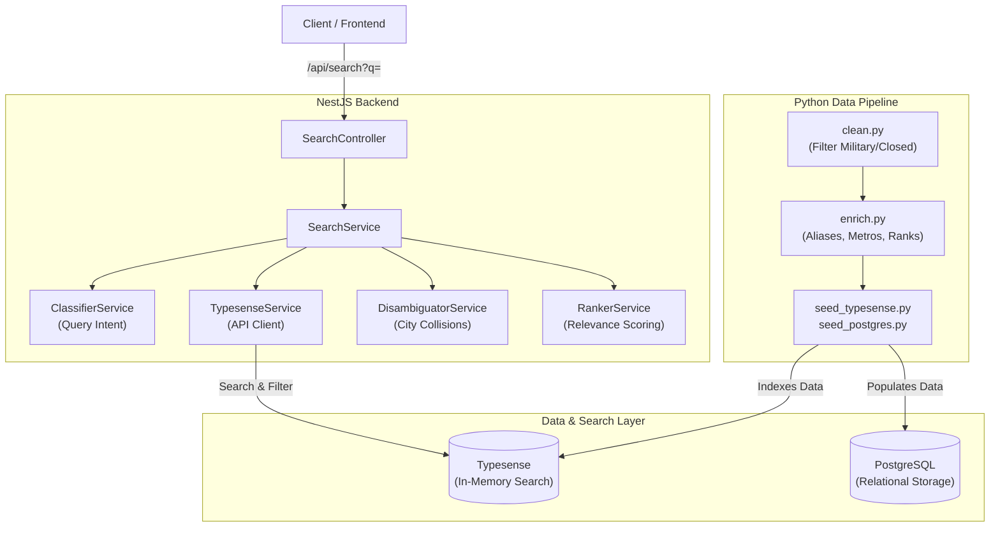

# Fly Fairly Backend (NestJS + Typesense + Postgres)

This is the API backend for the Fly Fairly airport search engine. It exposes the search and healthcheck endpoints.

## Architecture Diagram



## Prerequisites
- Node.js (v20+)
- Docker Compose (to run the Postgres and Typesense services)

## Infrastructure Setup

Before running the backend, you must start the required databases via Docker Compose.

```bash
# Start Postgres (port 15432) and Typesense (port 8108)
docker compose up -d
```

### Seeding the Data Pipeline

Before you can run the backend, you must process the raw data and seed the databases. The pipeline is located in the `pipeline/` directory.

```bash
cd pipeline

# Create a virtual environment (recommended)
python -m venv venv
source venv/bin/activate

# Install dependencies
pip install -r requirements.txt

# Run the pipeline scripts in order:
python src/clean.py          # Cleans raw CSVs
python src/enrich.py         # Enriches and groups data
python src/seed_postgres.py  # Seeds Postgres
python src/seed_typesense.py # Seeds Typesense
```

*Note: The pipeline generates the `metro_groups.json` and `regions.json` files that the backend requires to start successfully.*

## Installation

```bash
npm install
```

## Running the API

```bash
# development
npm run start

# watch mode (recommended for dev)
npm run start:dev
```

The API will be available at `http://localhost:3000`.

## Testing / Evaluations

An evaluation suite is included to test the accuracy of search results against known edge cases (typos, region searches, CJK scripts, etc).

```bash
# Runs the evaluation test suite against the running API
npm run eval
```
